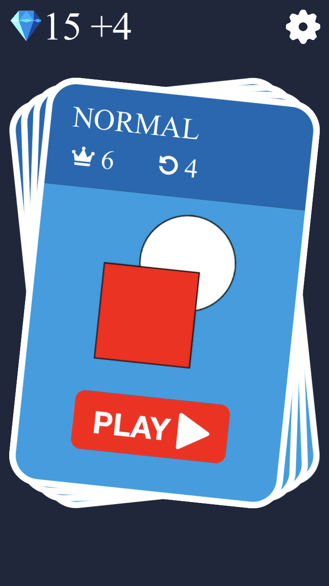
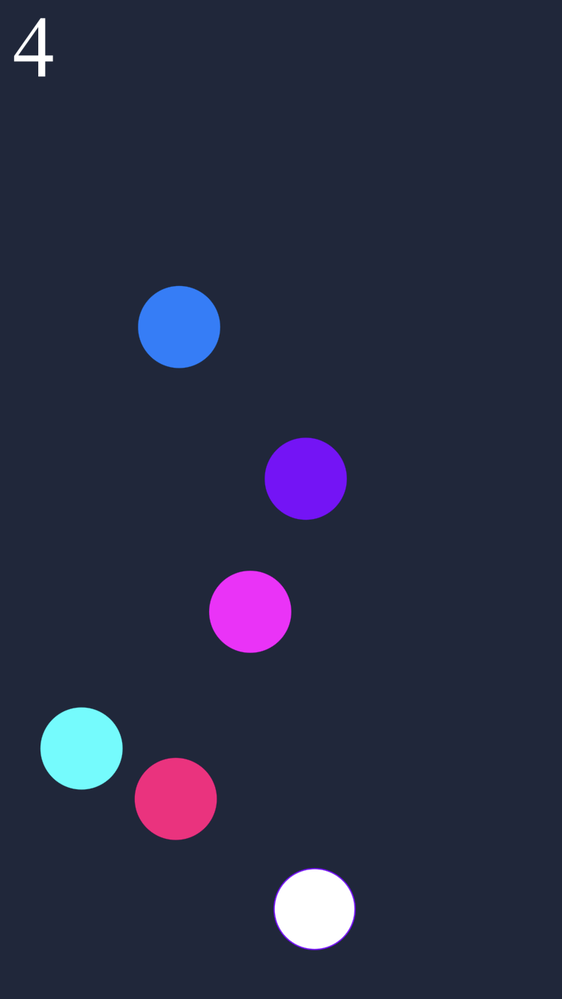
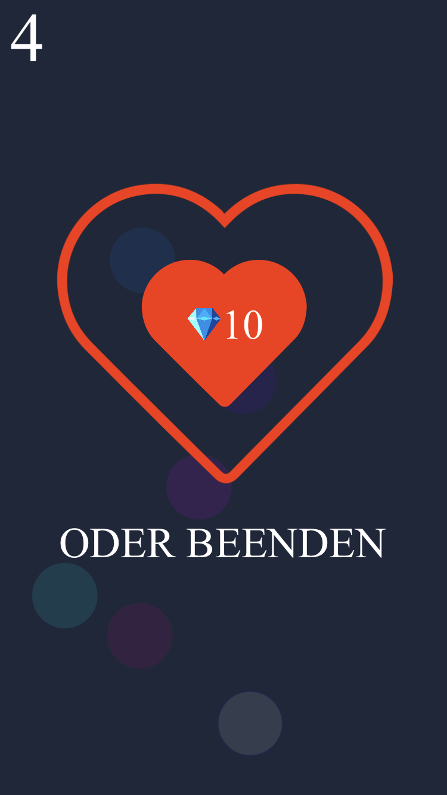

# mindgon
### A logical iOS game
The game starts with a single field. Each field has to be tapped twice where each tap creates a new field.
The goal is to tap at the fields in the order of appearing.

### Working modes
- Normal
- Timelimit - Including bonus fields to increase the remaining time
- Monochrome - All fields have the same color

### Screenshots

